# Happy Path Flow - Scenario Resolution

This document shows only the **happy path for support scenarios**.
It focuses on how a scenario moves from input to final outcome when the system behaves normally.

---

## 1) Scenario Engine in One Line

A support case comes in, the system gathers doc evidence + account evidence, then decides `resolve`, `clarify`, or `escalate`, and returns customer + internal responses.

---

## 2) Common Happy Path (All Scenarios)

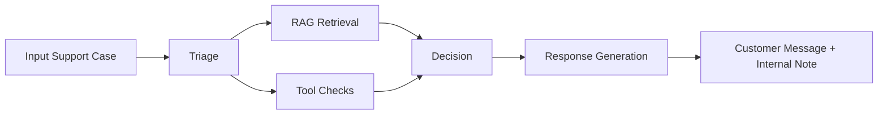

This is the base flow all scenarios follow.

---

## 3) Runtime Happy Path (Detailed)

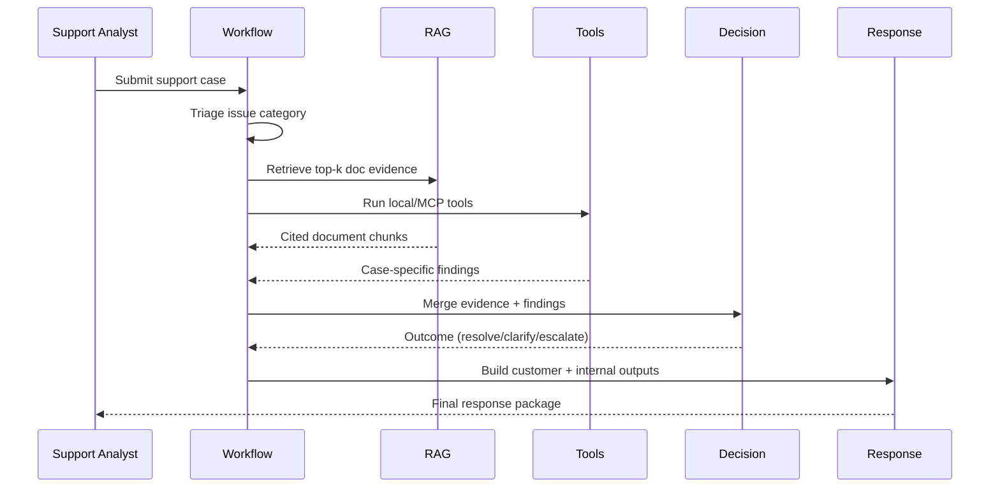

---

## 4) Scenario Happy Paths (Required Cases)

### Scenario 1: Feature entitlement dispute

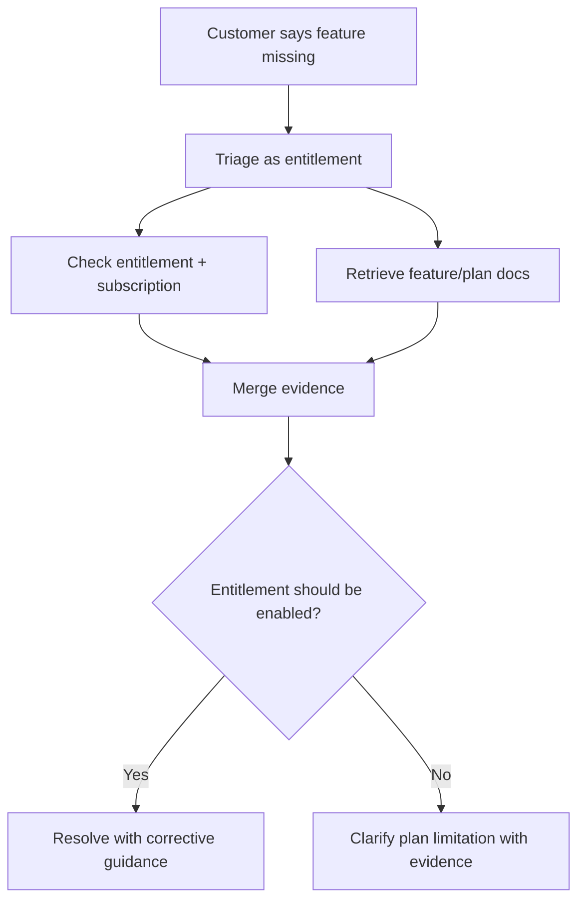

### Scenario 2: Paid features locked

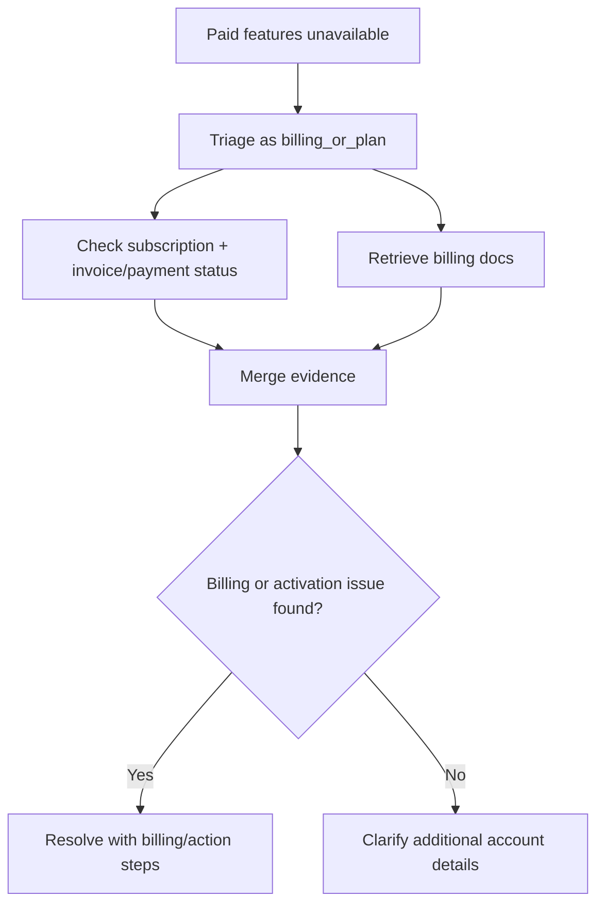

### Scenario 3: PAT fails for org resources

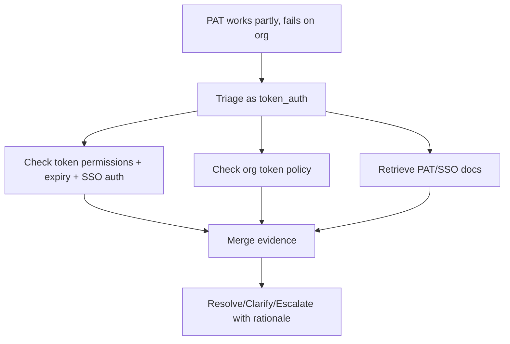

### Scenario 4: REST API rate-limit complaint

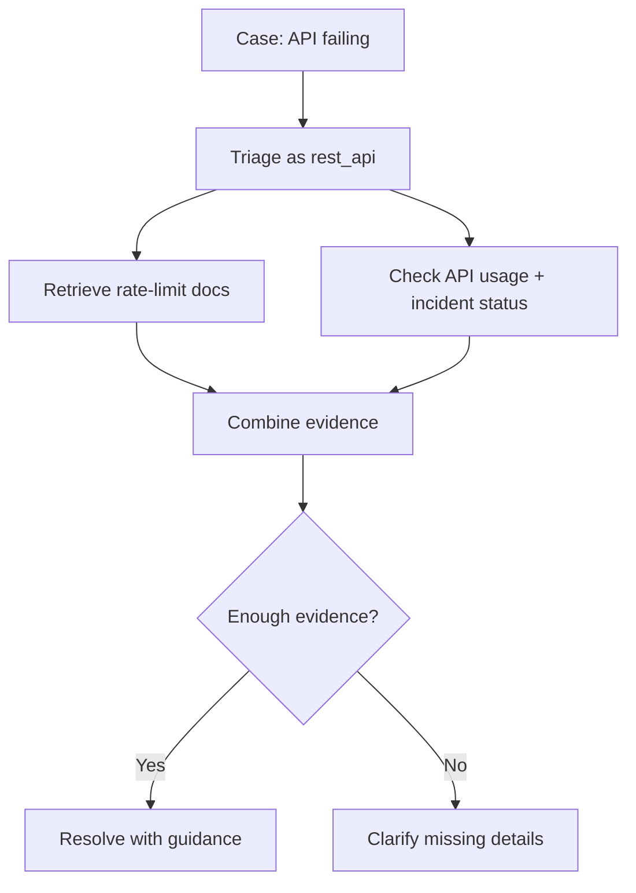

---

### Scenario 5: SAML SSO login failure

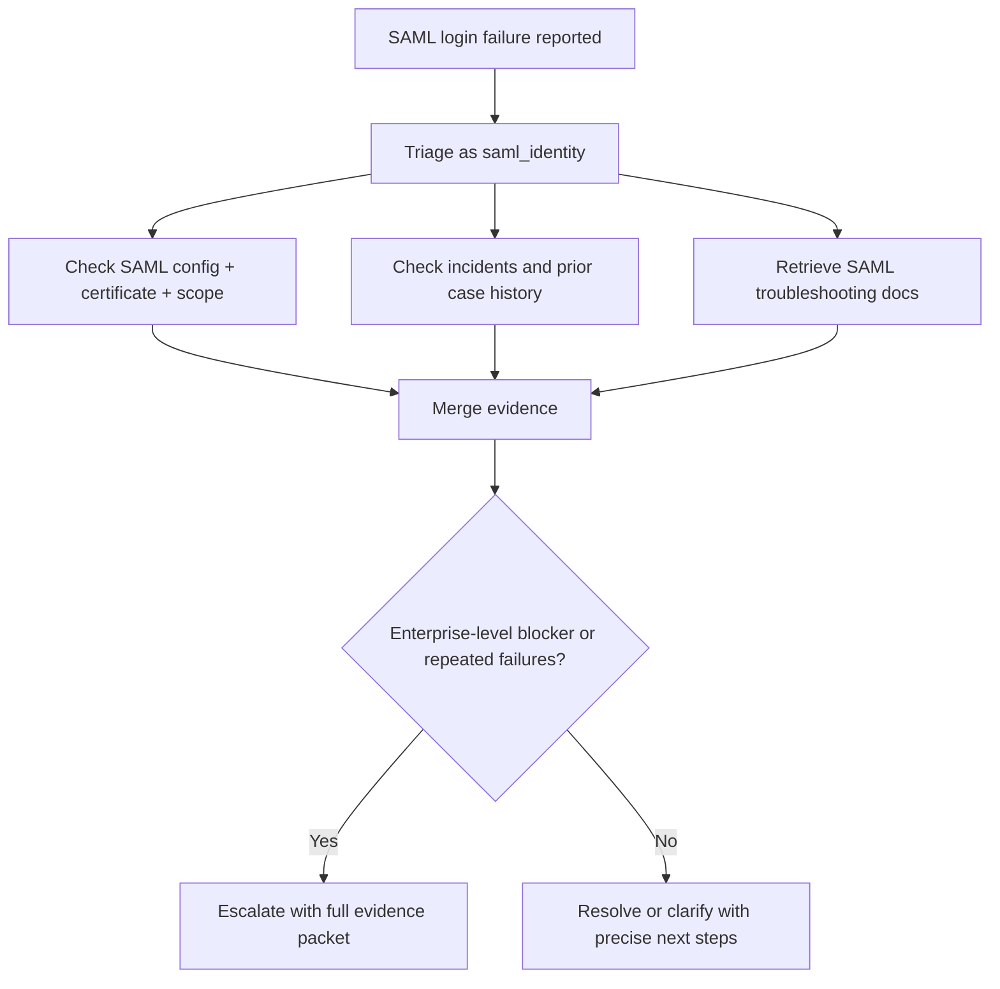

### Scenario 6: Repeated unresolved authentication issue

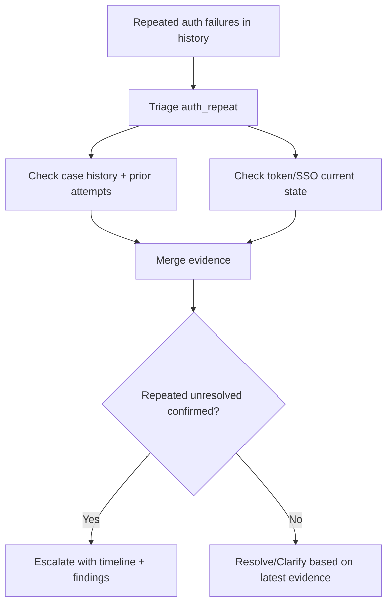

### Scenario 7: Ambiguous complaint

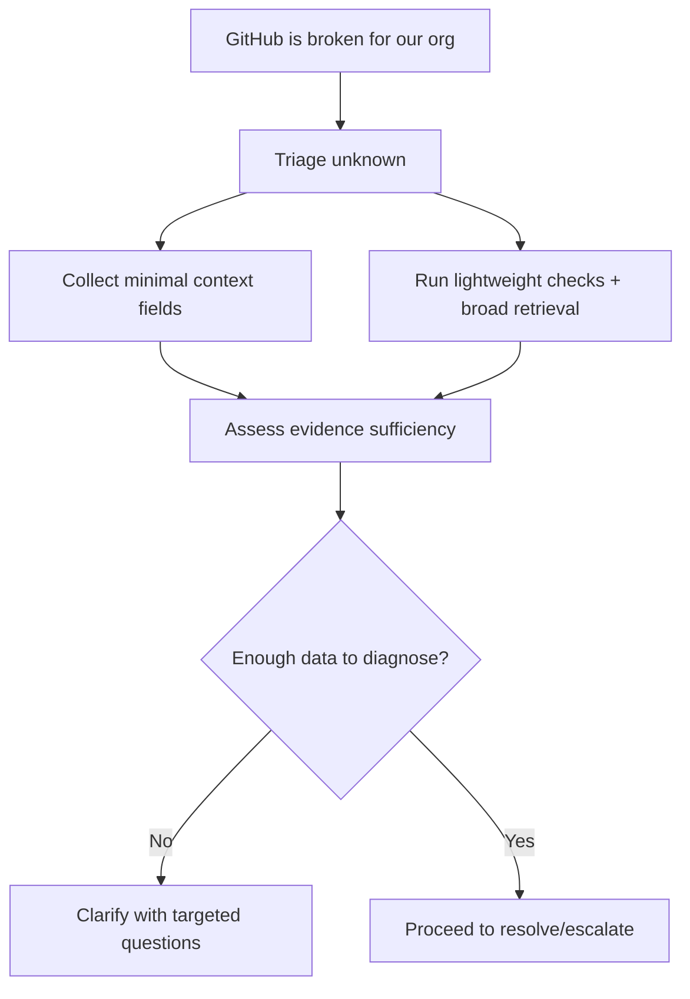

### Scenario 8: Billing plus technical issue

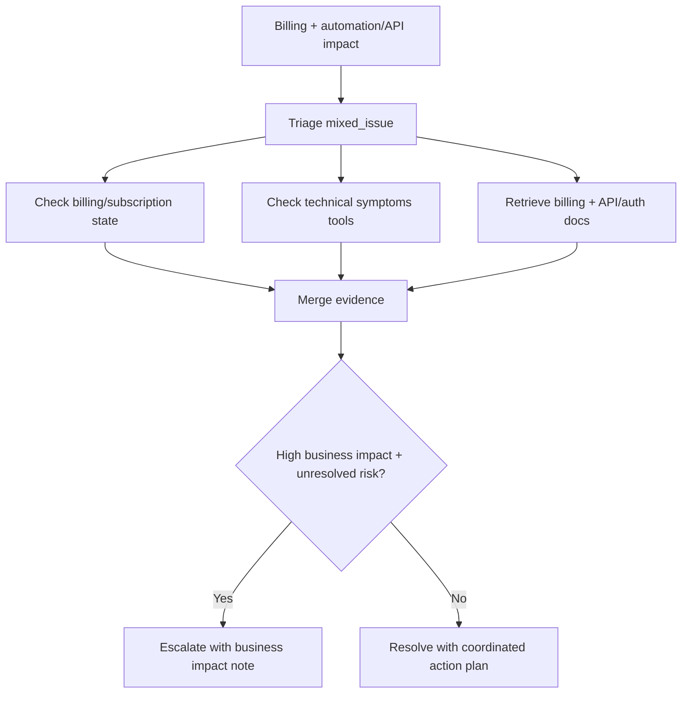

---

## 5) Outcome Happy Path

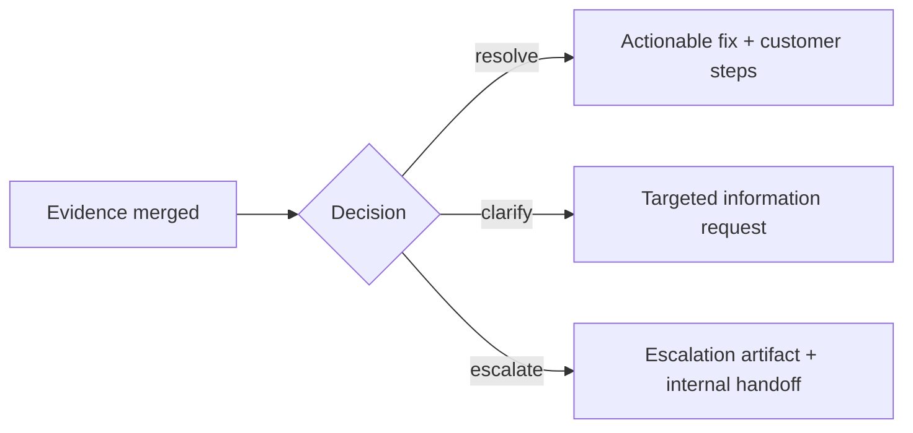

---

## 6) Common Scenario Deviations

- Retrieval returns weak citations -> refine query and chunking.
- Tool outputs conflict with docs -> mark conflict and choose `clarify` or `escalate`.
- Missing critical identifiers -> immediate `clarify`.
- Repeated unresolved + high impact -> `escalate` with history evidence.

---

## 7) What This Document Is For

Use this document to understand expected scenario resolution flows.
For technical implementation details, use `PHASE_IMPLEMENTATION_GUIDE.md` and `LLD.md`.
