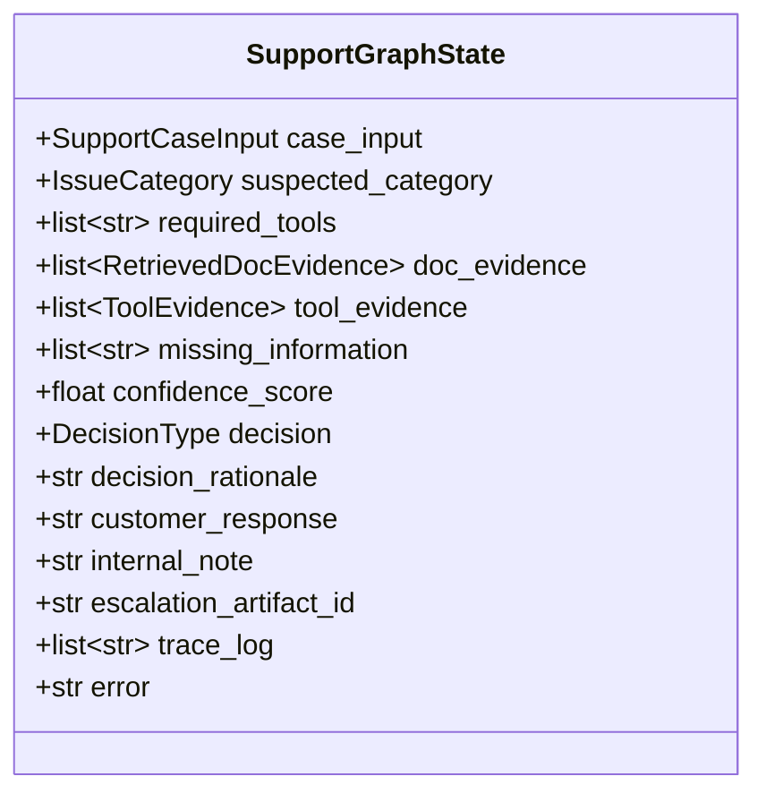
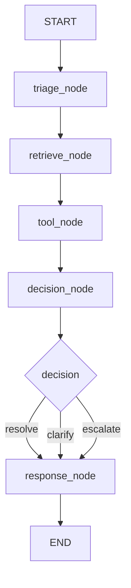
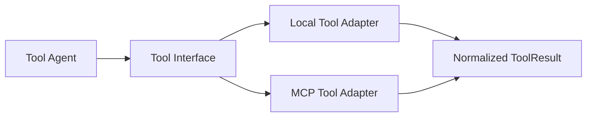
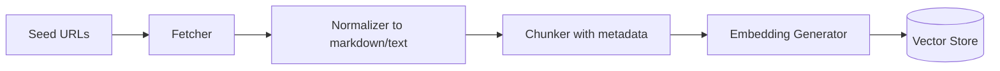
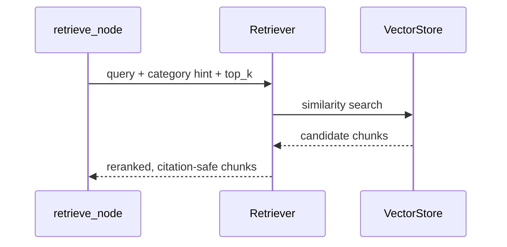
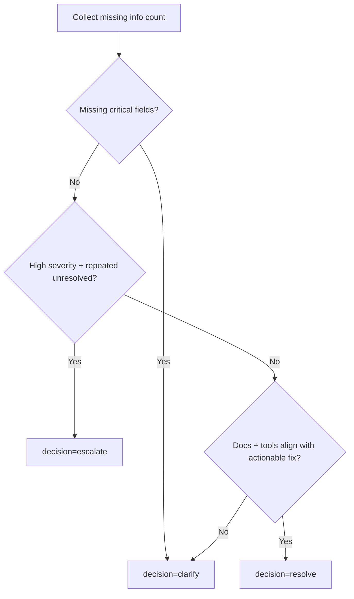
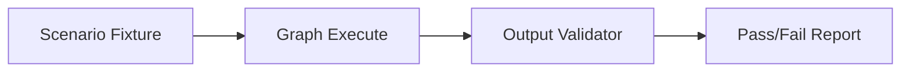
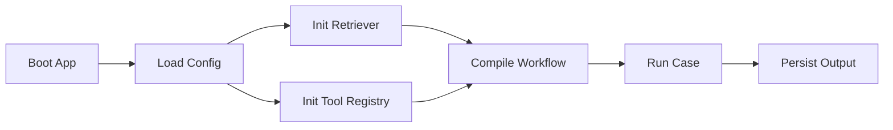

# LLD - Technical Customer Support Resolution System

## 1. Purpose of this LLD

This document translates the HLD into implementable modules, contracts, and step-by-step technical details for a beginner Python developer.

Focus:
- concrete file/module boundaries,
- data contracts (Pydantic),
- LangGraph state design,
- tool interfaces (local + MCP),
- RAG indexing and retrieval internals,
- test strategy and scenario execution.

---

## 2. Source Tree (Implementation-Oriented)

```text
src/
  app/
    main.py
    config.py
    bootstrap.py
  domain/
    entities.py
    support_case.py
    outputs.py
    enums.py
  rag/
    corpus_loader.py
    normalizer.py
    chunker.py
    indexer.py
    retriever.py
  tools/
    contracts.py
    local/
      toolkit.py
    mcp/
      mcp_client.py
      mcp_tools.py
  agents/
    prompts/
      triage_prompt.txt
      retrieval_prompt.txt
      decision_prompt.txt
      response_prompt.txt
    triage_agent.py
    retrieval_agent.py
    tool_agent.py
    decision_agent.py
    response_agent.py
  graph/
    support_case_graph.py
  workflow/
    case_resolution.py
  scenarios/
    fixtures/
      scenario_1.json
      ...
      scenario_8.json
    run_scenarios.py
  evaluation/
    validators.py
    report_writer.py
tests/
```

---

## 3. Data Contracts (Pydantic Models)

## 3.1 Core Enums
- `IssueCategory`: billing, entitlement, token_auth, rest_api, saml_identity, unknown
- `DecisionType`: resolve, clarify, escalate
- `Severity`: low, medium, high, critical

## 3.2 Input Model
- `SupportCaseInput`
  - `case_id: str`
  - `customer_id: str | None`
  - `org_id: str | None`
  - `title: str`
  - `description: str`
  - `severity: Severity`
  - `metadata: dict[str, str] = {}`

## 3.3 Evidence Models
- `RetrievedDocEvidence`
  - `source_url`
  - `chunk_id`
  - `excerpt`
  - `relevance_score`
- `ToolEvidence`
  - `tool_name`
  - `status`
  - `findings: dict`
  - `confidence: float`

## 3.4 Final Output Model
- `SupportResolutionOutput`
  - `issue_type`
  - `docs_evidence: list[RetrievedDocEvidence]`
  - `tools_used: list[str]`
  - `important_findings: list[str]`
  - `decision: DecisionType`
  - `decision_rationale: str`
  - `customer_response: str`
  - `internal_note: str`
  - `escalation_artifact_id: str | None`

---

## 4. LangGraph State Design



State design rule:
- every node reads state and returns **partial updates**,
- state is merged by graph runtime.

---

## 5. Node-Level Design

## 5.1 `triage_node`
Input:
- `case_input`

Process:
- classify issue category,
- extract missing fields,
- decide which tool families are required.

Output updates:
- `suspected_category`
- `required_tools`
- `missing_information`

## 5.2 `retrieve_node`
Input:
- case query + suspected category

Process:
- build retrieval query,
- fetch top-k chunks,
- keep only citation-safe snippets.

Output:
- `doc_evidence`

## 5.3 `tool_node`
Input:
- `required_tools`, identifiers from case

Process:
- call local tools and MCP tools,
- normalize outputs into `ToolEvidence`.

Output:
- `tool_evidence`

## 5.4 `decision_node`
Input:
- `doc_evidence`, `tool_evidence`, `missing_information`

Process:
- apply deterministic rubric + LLM reasoning assist,
- produce final decision and rationale.

Output:
- `decision`
- `decision_rationale`

## 5.5 `response_node`
Input:
- all prior evidence + decision

Process:
- generate customer-friendly response,
- generate internal support note,
- create escalation artifact when needed.

Output:
- `customer_response`
- `internal_note`
- `escalation_artifact_id` (if escalated)

---

## 6. Graph Edges and Routing



Error policy:
- if any node raises recoverable error, append trace and route to safe `clarify` response path.

---

## 7. Tool Layer Design

## 7.1 Common Tool Contract

Each tool returns:
- `tool_name`
- `success: bool`
- `findings: dict`
- `errors: list[str]`
- `confidence: float`



## 7.2 Required Tools Mapping

- `get_customer_org_context`
- `get_subscription_state`
- `get_entitlement_status`
- `diagnose_token_auth`
- `get_case_history`
- `get_service_incidents`
- `create_escalation_artifact`

MCP coverage requirement:
- at least one of above must be implemented via MCP adapter.

Recommended MCP-first candidate:
- `get_service_incidents` via MCP.

---

## 8. RAG Internals

## 8.1 Ingestion Pipeline



Metadata per chunk:
- `source_url`
- `title`
- `section_heading`
- `doc_version` (if available)
- `ingested_at`

## 8.2 Retrieval Pipeline



RAG safety rule:
- decision and response nodes can only cite URLs that exist in `doc_evidence`.

---

## 9. Prompt Design (LLD View)

Each prompt template has:
- role objective,
- allowed inputs,
- required output schema,
- prohibition on unsupported assumptions.

Example constraints:
- If tool evidence conflicts with docs, flag conflict in rationale.
- If key data missing, recommend `clarify`.
- For escalation, specify exactly why frontline resolution is insufficient.

---

## 10. Decision Engine: Hybrid Policy

Use deterministic checks first, then LLM for phrasing/rationale quality.



This reduces hallucination risk and makes behavior testable.

---

## 11. Error Handling and Retries

- LLM calls: retry x2 with exponential backoff
- MCP calls: timeout + one retry + fallback warning
- Retriever empty results: route to `clarify` with explicit missing data request
- Uncaught exception: produce safe internal error note and non-fabricated customer message

---

## 12. Testing Plan (LLD)

## Unit Tests
- model validation
- tool contract behavior
- decision rubric branches

## Integration Tests
- retrieve node returns citations
- tool node aggregates local + MCP tool outputs
- graph executes end-to-end

## Scenario Tests
- 8 fixtures from required scenarios
- each test validates:
  - output schema
  - one valid decision type
  - docs citations present
  - customer/internal responses present



---

## 13. Logging and Trace Design

Minimum per case:
- `trace_id`
- node start/end timestamps
- selected tools and statuses
- decision and rationale summary

Log format:
- JSON lines for machine readability.

---

## 14. Configuration Design

Environment variables:
- `LLM_PROVIDER`
- `LLM_MODEL`
- `GROQ_API_KEY`
- `EMBEDDING_PROVIDER`
- `VECTOR_DB_PATH`
- `MCP_SERVER_URL`
- `LOG_LEVEL`

Config loading:
- `app/config.py` reads env and validates with Pydantic settings.

---

## 15. Build and Run Flows

## 15.1 Setup
1. create env using `uv`
2. install dependencies
3. configure `.env`
4. ingest docs

## 15.2 Runtime
1. load config
2. initialize retriever and tools
3. compile LangGraph
4. run case
5. write output artifact



---

## 16. Scenario-to-Tool Coverage Matrix

- Scenario 1 entitlement dispute -> entitlement + subscription + docs
- Scenario 2 paid features locked -> billing/subscription + entitlement + history
- Scenario 3 PAT failing org resources -> token diagnostics + org policy + SSO docs
- Scenario 4 API rate limit complaint -> api usage + rate-limit docs + incident check
- Scenario 5 SAML login failure -> SAML config + incident + enterprise/org scope logic
- Scenario 6 repeated unresolved auth -> case history + auth diagnostics + escalation path
- Scenario 7 ambiguous complaint -> triage + clarify outcome with data request
- Scenario 8 billing + technical issue -> combined billing + API/auth tools + severity routing

---

## 17. LLD Acceptance Criteria

- All modules and contracts are implementable and testable.
- Graph state is explicit and sufficient.
- Tool interfaces are normalized across local and MCP sources.
- RAG design is citation-first and evidence-safe.
- Scenario flow is reproducible for all required cases.

---

## 18. Beginner Implementation Order

1. Implement domain models and output schema.
2. Implement local tools with mock data.
3. Implement RAG ingestion + retrieval.
4. Build minimal graph (triage -> retrieve -> decision -> response).
5. Add tool node and MCP integration.
6. Add tests and scenario runner.
7. Tune prompts and reliability behavior.
