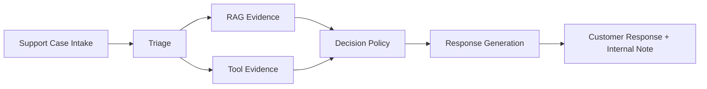
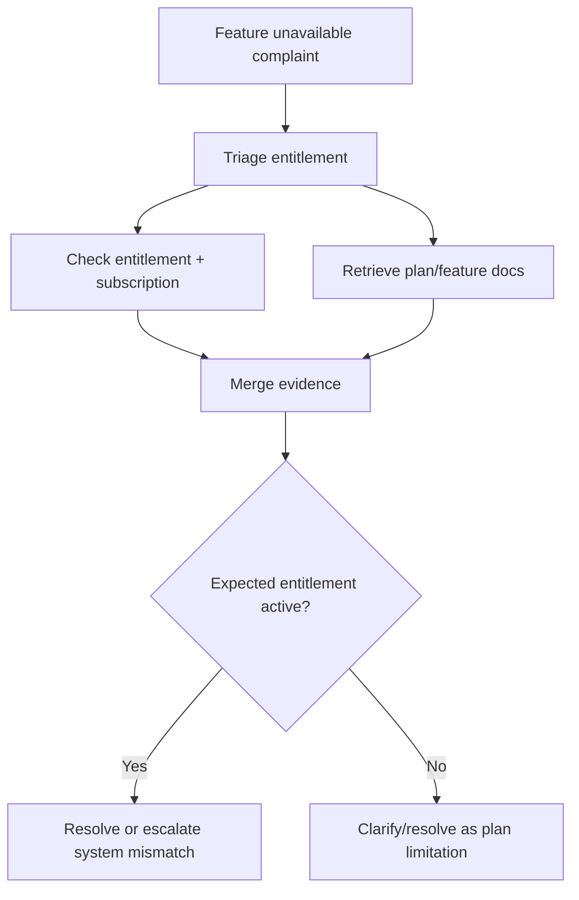
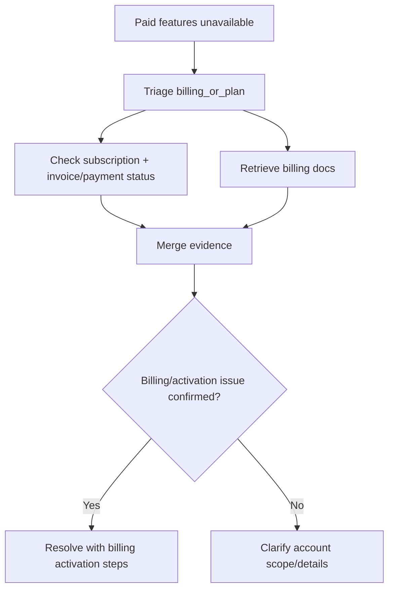
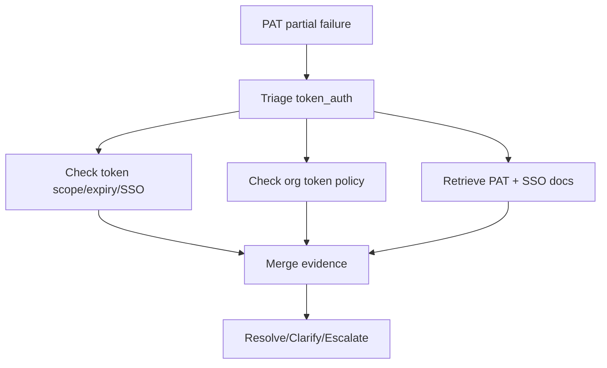
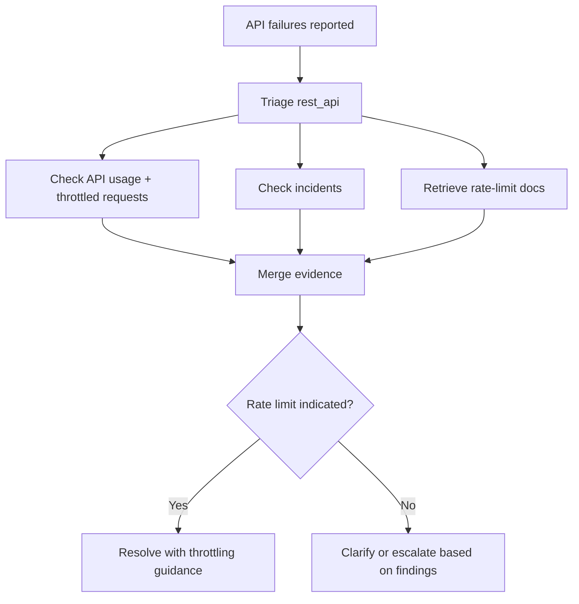
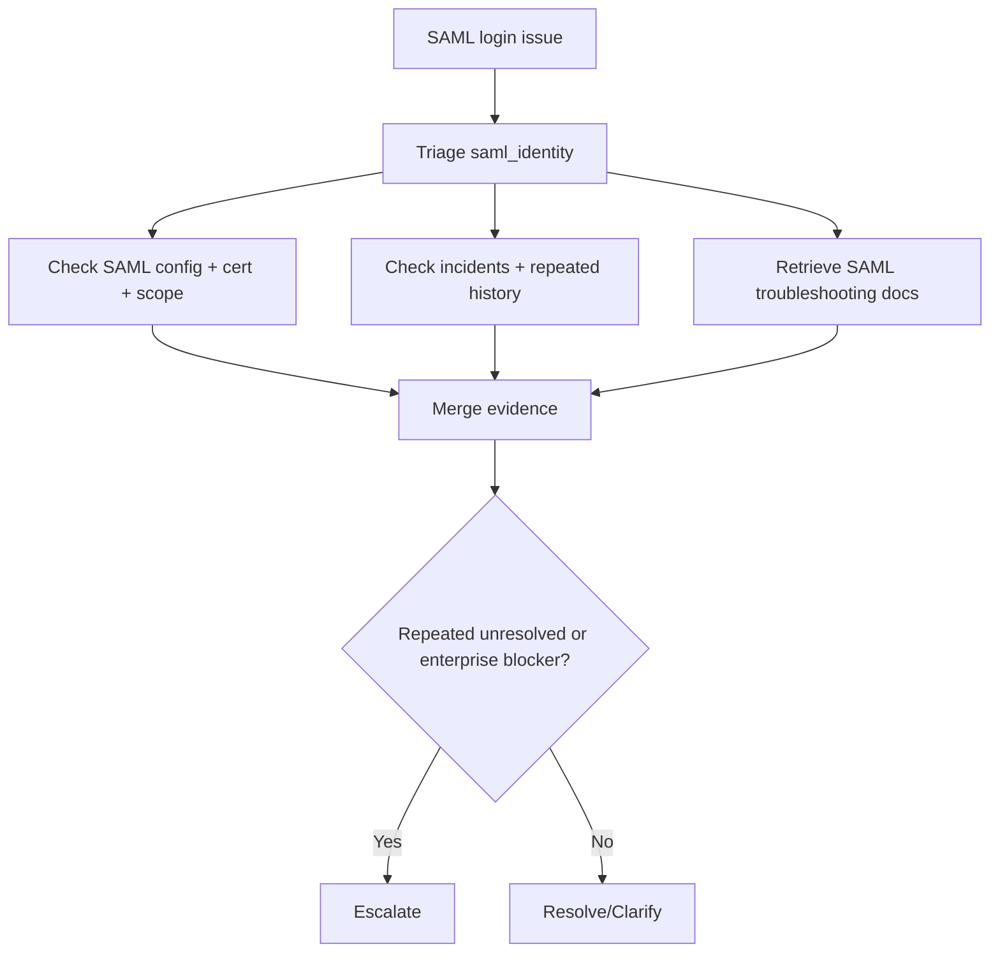
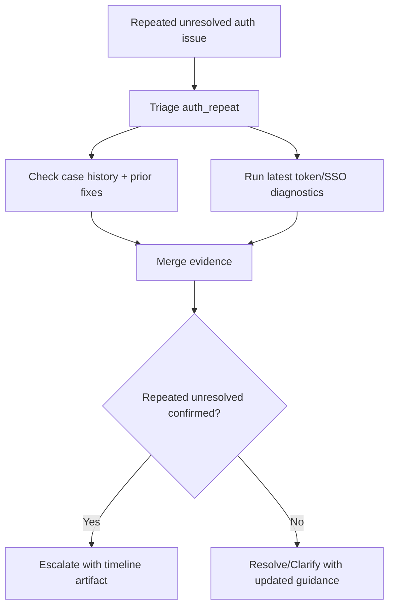
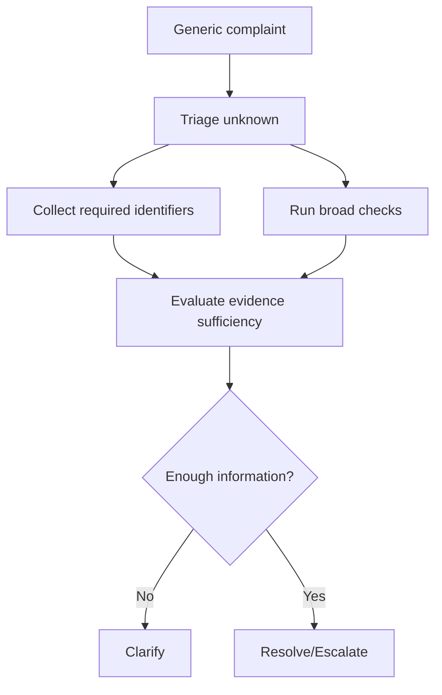
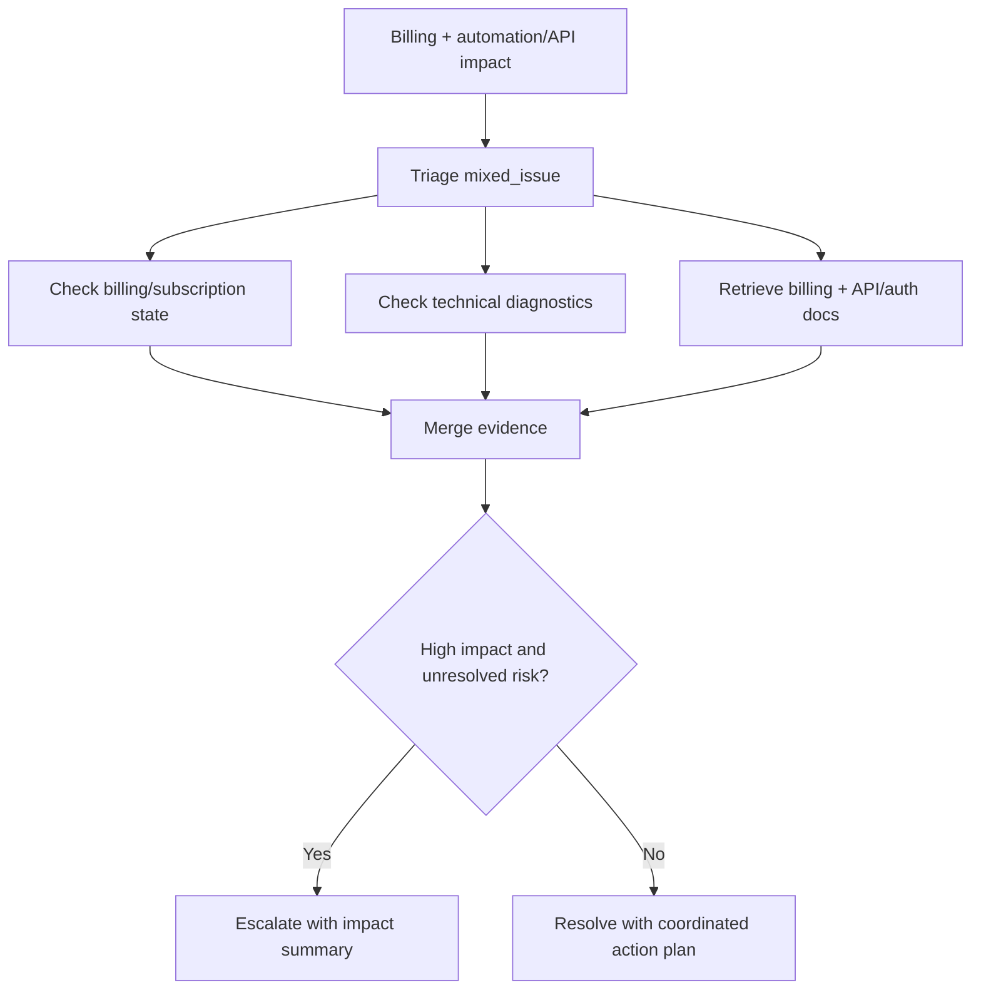

# Standard Happy Path Flow - Scenario Resolution

Scenario-focused happy paths for standard architecture version.

## 1) Global Scenario Flow

## 2) Scenario 1 - Entitlement Dispute

## 3) Scenario 2 - Paid Features Locked

## 4) Scenario 3 - PAT Fails on Org Resources

## 5) Scenario 4 - REST API Rate Limit Complaint

## 6) Scenario 5 - SAML SSO Login Failure

## 7) Scenario 6 - Repeated Unresolved Authentication Issue

## 8) Scenario 7 - Ambiguous Complaint

## 9) Scenario 8 - Billing Plus Technical Issue

## 10) Outcome Coverage Check
- Scenario 1: resolve or clarify
- Scenario 2: resolve or clarify
- Scenario 3: resolve/clarify/escalate
- Scenario 4: resolve or clarify/escalate
- Scenario 5: clarify or escalate (sometimes resolve)
- Scenario 6: escalate-biased
- Scenario 7: clarify-biased
- Scenario 8: resolve or escalate
