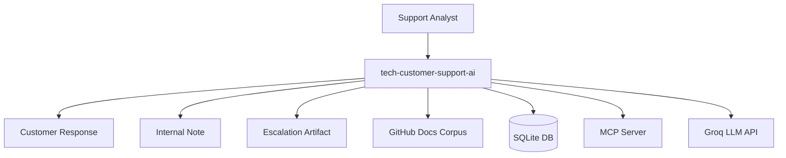
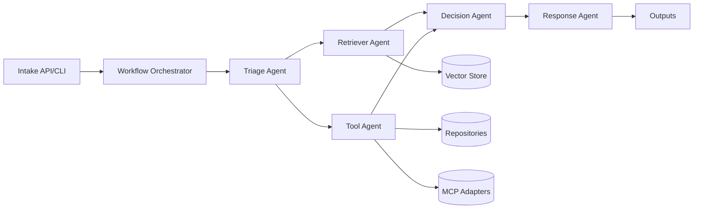
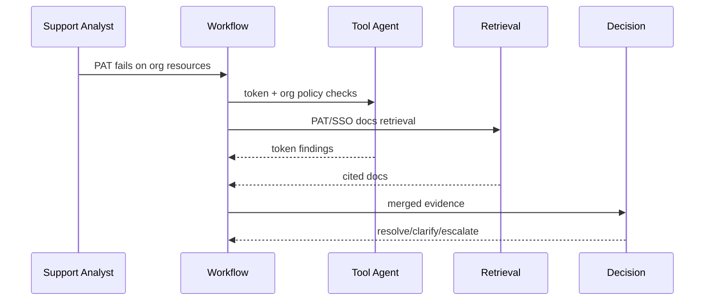
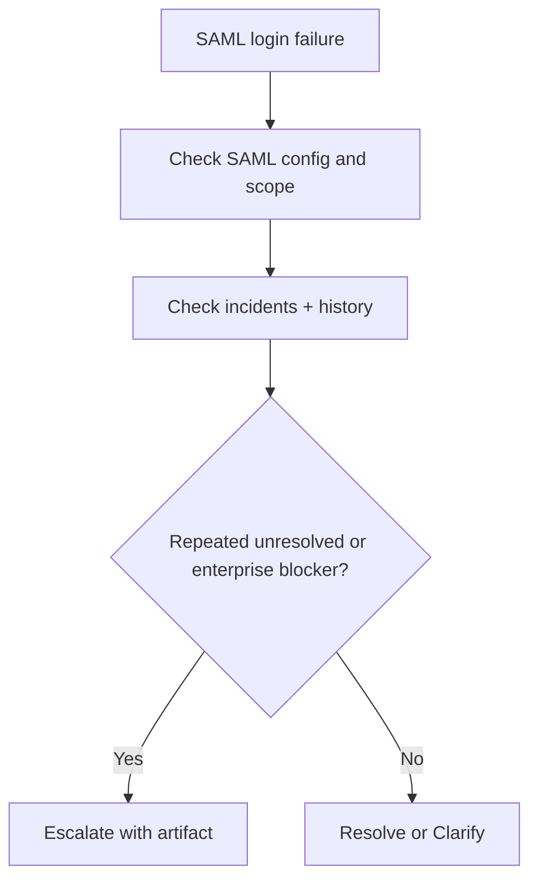
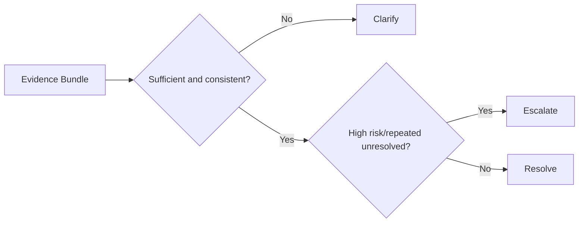

# Standard HLD - tech-customer-support-ai

## 1. System Purpose
Internal support analysts submit GitHub.com support cases.  
System gathers evidence (docs + tools), determines the best next action, and generates customer/internal outputs.

## 2. Context and Boundary

## 3. Logical Architecture

## 4. Non-Functional Design
- Reliability: retries, timeout, safe fallback to `clarify`.
- Scalability: stateless orchestration, pluggable LLM/retriever/tool adapters.
- Security: secret isolation, data masking, schema validation.
- Observability: per-case trace id + node-level structured logs.

## 5. Use Case Flows
### PAT Failure (Org Resources)

### SAML Failure (Escalation-biased)

## 6. Outcome Policy

## 7. Scenario Coverage Matrix
- Scenario 1: entitlement dispute -> plan/entitlement evidence path
- Scenario 2: paid features locked -> billing/subscription path
- Scenario 3: PAT failure on org resources -> token/policy/SSO path
- Scenario 4: API rate limit complaint -> API usage + docs path
- Scenario 5: SAML login failure -> SAML config + incident + history
- Scenario 6: repeated unresolved auth -> escalation-biased history path
- Scenario 7: ambiguous complaint -> clarify-biased missing-info path
- Scenario 8: billing + technical issue -> mixed-evidence coordination path

## 8. MCP and Local Tool Strategy
- Default flow uses local tools for deterministic account checks.
- At least one mandatory tool call is routed through MCP.
- If MCP is unavailable, system records degraded-mode warning and uses local fallback only where safe.
