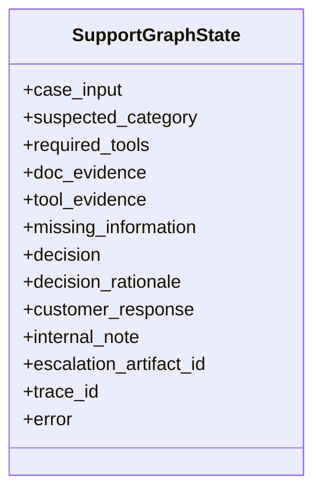

# Standard LLD - tech-customer-support-ai (Detailed)

This LLD defines implementable technical contracts for a production-style support resolution system.

---

## 1) Layered Architecture and Dependency Rule

### Layers
- **Interface layer:** API/CLI entrypoints and DTO schemas.
- **Graph layer:** LangGraph orchestration and routing.
- **Agent layer:** role-specific reasoning components.
- **Service layer:** business flow utilities and policy helpers.
- **Tool layer:** local and MCP tools with normalized return shape.
- **Persistence layer:** DB models + repositories.
- **Domain layer:** Pydantic entities and enums.

### Dependency rule
- Allowed flow: Interface -> Graph -> Agents/Services -> Tools/Repositories -> DB/External.
- Forbidden flow: Agents directly importing DB session/ORM models.

---

## 2) Core Data Contracts

### 2.1 Input Contract
`SupportCaseInput` fields:
- `case_id: str`
- `customer_id: str | None`
- `org_id: str | None`
- `title: str`
- `description: str`
- `severity: str`
- `metadata: dict[str, str]`

### 2.2 Evidence Contracts
- `RetrievedDocEvidence`:
  - `source_url`
  - `chunk_id`
  - `excerpt`
  - `relevance_score`
- `ToolEvidence`:
  - `tool_name`
  - `tool_source` (`local|mcp`)
  - `success`
  - `findings`
  - `errors`
  - `confidence`

### 2.3 Output Contract
`SupportResolutionOutput`:
- `issue_type`
- `docs_evidence`
- `tools_used`
- `important_findings`
- `decision`
- `decision_rationale`
- `customer_response`
- `internal_note`
- `escalation_artifact_id`

---

## 3) Domain to Persistence Mapping

Business entities from kata map to DB tables:
- customer -> `customer`
- github organization -> `github_organization`
- enterprise account -> `enterprise_account`
- subscription -> `subscription`
- invoice -> `invoice`
- entitlement -> `entitlement`
- token record -> `token_record`
- SAML configuration -> `saml_configuration`
- API usage -> `api_usage`
- support case -> `support_case`
- case history -> `case_history`
- service status -> `service_status`
- incident -> `incident`

Design note:
- Domain models remain framework-neutral.
- Table models include storage-specific details (indexes, foreign keys).

---

## 4) Repository Contracts

Repository interfaces:
- `CaseRepository`
- `CustomerRepository`
- `OrgRepository`
- `AuthRepository`
- `IncidentRepository`

Repository contract principles:
- return plain typed payloads (not ORM objects)
- isolate query complexity
- avoid business decision logic in repositories

Example interface:
```python
class CaseRepository(Protocol):
    def get_case(self, case_id: str) -> dict | None: ...
    def save_case(self, payload: dict) -> None: ...
    def list_case_history(self, case_id: str) -> list[dict]: ...
```

---

## 5) Tool Layer Contract

All tools return normalized `ToolResult`.

```python
ToolResult(
  tool_name: str,
  tool_source: str,   # local or mcp
  success: bool,
  findings: dict,
  errors: list[str],
  confidence: float
)
```

Tool families:
- account context tools
- billing/subscription tools
- entitlement tools
- token/auth tools
- incident/service tools
- escalation artifact tool

---

## 6) MCP Integration Specification

Minimum MCP coverage:
- `get_service_incidents`
- optional: `create_escalation_artifact`

Execution policy:
1. call MCP tool
2. timeout + retry once
3. if failed, record warning and fallback to local path where safe

Audit policy:
- every tool evidence row includes `tool_source`
- degraded mode must be visible in internal note/logs

---

## 7) RAG Pipeline Specification

### Ingestion
- source: seed URLs from assignment
- normalize text
- chunk size: 700-1000 chars
- overlap: 100-150 chars

### Metadata contract per chunk
- `source_url`
- `chunk_id`
- `title` (if available)
- `section_heading` (if available)

### Retrieval contract
- return top_k chunks with scores
- threshold low-quality chunks out
- non-clarify decision must include at least one doc citation

---

## 8) Graph State Model



State rule:
- each node returns partial update only
- orchestrator merges updates

---

## 9) Node-Level I/O Contracts

### `triage_node`
- input: `case_input`
- output: `suspected_category`, `required_tools`, `missing_information`

### `retrieve_node`
- input: case text + category
- output: `doc_evidence`

### `tool_node`
- input: required tools + identifiers
- output: `tool_evidence`

### `decision_node`
- input: doc + tool evidence + missing fields
- output: `decision`, `decision_rationale`

### `response_node`
- input: decision + all evidence
- output: `customer_response`, `internal_note`, `escalation_artifact_id`

---

## 10) Decision Policy Contract

Decision precedence:
1. if critical info missing -> `clarify`
2. if repeated unresolved/high impact -> `escalate`
3. if evidence sufficient and actionable -> `resolve`
4. else -> `clarify`

Safety rule:
- never resolve on docs-only evidence when case-specific checks are required.

---

## 11) API and Interface Contracts

### POST `/cases/resolve`
- request model: `SupportCaseInput`
- response model: `SupportResolutionOutput`

### GET `/cases/{case_id}`
- response: stored case + latest resolution snapshot

Validation behavior:
- invalid payload -> `ValidationError` response
- runtime failure -> safe clarify-style response envelope

---

## 12) Error Taxonomy and Recovery

- `ValidationError` -> bad intake payload
- `ToolExecutionError` -> tool timeout/failure
- `RetrievalError` -> retriever/vector failure
- `DecisionError` -> policy evaluation failure

Recovery policy:
- if uncertain due to technical failure, return safe `clarify`
- never fabricate evidence

---

## 13) Scenario-to-Tool Mapping (8 Required)

- Scenario 1: entitlement + subscription + docs
- Scenario 2: subscription + invoice + entitlement + docs
- Scenario 3: token diagnostics + org policy + SSO docs
- Scenario 4: API usage + incident + rate-limit docs
- Scenario 5: SAML config + incident + history + SAML docs
- Scenario 6: case history + token/SSO diagnostics + escalation tool
- Scenario 7: customer/org context + broad retrieval + clarify path
- Scenario 8: billing tools + technical tools + mixed-impact decision

---

## 14) Output Validation Rules

Every output must include non-empty:
- `issue_type`
- `decision`
- `decision_rationale`
- `customer_response`
- `internal_note`

Conditional rules:
- if `decision != clarify`, `docs_evidence` must not be empty
- if `decision == escalate`, `escalation_artifact_id` must be present

---

## 15) Testing Matrix (Detailed)

### Unit tests
- domain model validation
- repository behavior
- tool adapter contract
- decision rules

### Integration tests
- graph end-to-end with seeded DB
- retriever + decision interaction
- MCP fallback path behavior

### Scenario tests
- 8 required scenarios
- output schema and mandatory section checks
- decision type assertions

### API contract tests
- valid/invalid payload handling
- response schema correctness

---

## 16) Observability and Auditability

Minimum telemetry fields:
- `trace_id`
- `case_id`
- node start/end
- tools invoked + source (`local|mcp`)
- decision and rationale summary

Log format:
- structured JSON lines for machine analysis.
