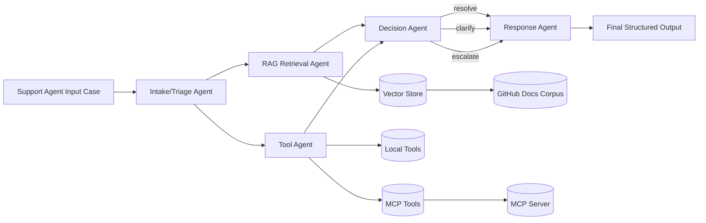
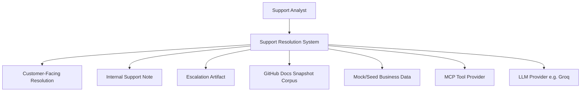
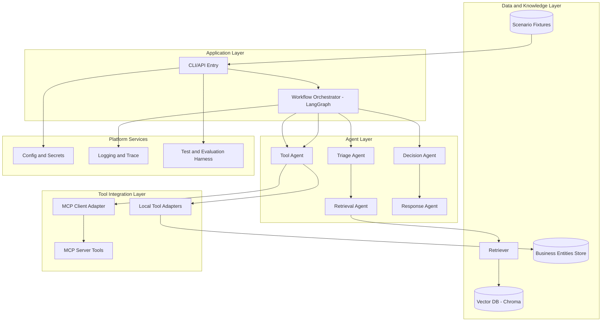
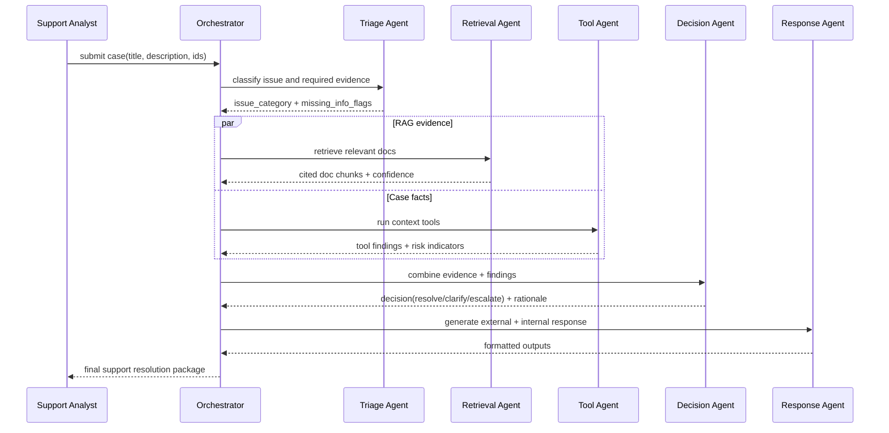
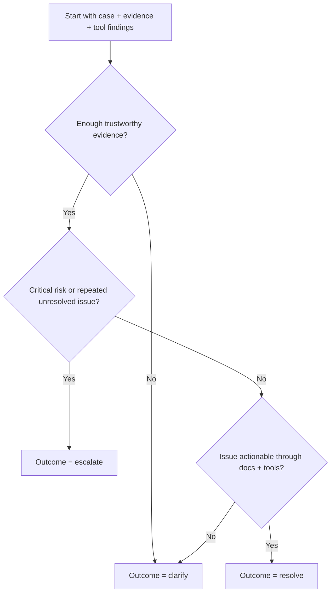
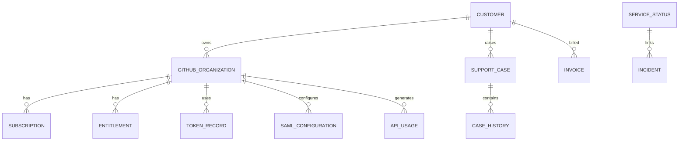
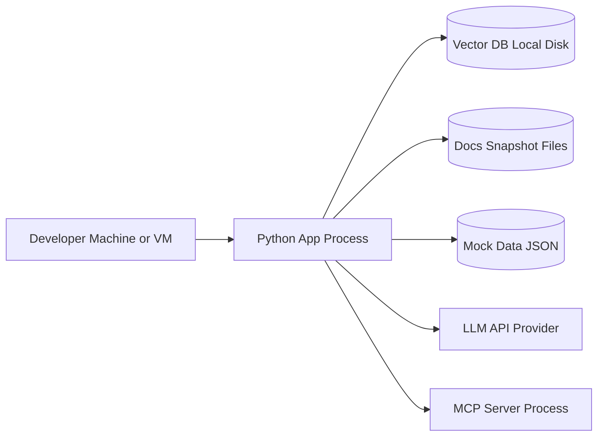

# HLD - Technical Customer Support Resolution System

## 1. Objective

Build a **multi-agent technical support resolution system** for GitHub.com support workflows that can:
- understand support cases,
- gather evidence from docs and tools,
- decide one of `resolve | clarify | escalate`,
- produce both customer-facing and internal responses.

This HLD is written for beginners and focuses on **why each block exists** before implementation details.

---

## 2. Scope and Non-Goals

## In Scope
- Multi-agent architecture
- RAG over GitHub Docs corpus
- Tool layer with at least partial MCP integration
- Eight required scenarios from kata
- Structured output with evidence and decision trail

## Out of Scope (for first version)
- Direct integration with real GitHub private support systems
- Full human-agent UI workflow management
- Advanced analytics dashboard

---

## 3. Functional Requirements Mapping

The system must support:
- Plan and billing troubleshooting
- Entitlement disputes
- PAT/auth issues
- API failure and rate-limit diagnosis
- SAML/identity issues
- Repeated unresolved issue escalation
- Ambiguous case clarification
- Mixed billing + technical issue handling

And always output:
- likely issue type
- docs evidence
- tools used
- key findings
- decision (`resolve`, `clarify`, `escalate`)
- customer response
- internal note

---

## 4. High-Level Architecture

### Why this shape?
- **Triage** narrows search space and tool usage.
- **RAG agent** provides grounded documentation evidence.
- **Tool agent** fetches case-specific facts (cannot be solved by docs alone).
- **Decision agent** enforces outcome policy.
- **Response agent** formats communication for external and internal audiences.

---

## 5. Context Diagram (System Boundary)

---

## 6. Logical Component View

---

## 7. End-to-End Runtime Flow

---

## 8. Decision Policy (Business Logic at High Level)

---

## 9. Data Domains (Conceptual)

This model supports:
- account-level diagnosis,
- entitlement verification,
- auth and policy debugging,
- history-aware escalation.

---

## 10. Non-Functional Requirements

## Reliability
- deterministic tool contracts
- timeout/retry wrappers around LLM/tool calls
- fallback to `clarify` when uncertain

## Scalability
- stateless orchestrator node logic
- swappable vector store and LLM provider
- decoupled tool adapters (local and MCP)

## Observability
- trace ID per case
- per-node logs
- persisted evidence trail for audit

## Security
- secrets in env only
- sensitive values masked in logs
- validation on all tool inputs/outputs

---

## 11. Deployment View (Initial)

For first release, this local deployment is enough. Later it can evolve to containerized services.

---

## 12. Risks and Mitigations

- RAG retrieves weak chunks -> improve chunking metadata and query expansion.
- LLM output inconsistency -> use strict schema + output parser.
- MCP tool instability -> circuit breaker and fallback to local read-only diagnostics.
- Beginner complexity overload -> phase-based build with weekly checkpoints.

---

## 13. HLD Acceptance Checklist

- Architecture supports all mandatory kata requirements.
- Multi-agent flow and decision routing are explicit.
- RAG + tools + MCP integration are visible in design.
- Outputs include both customer and internal artifacts.
- Design enables reliable, testable, incremental implementation.
